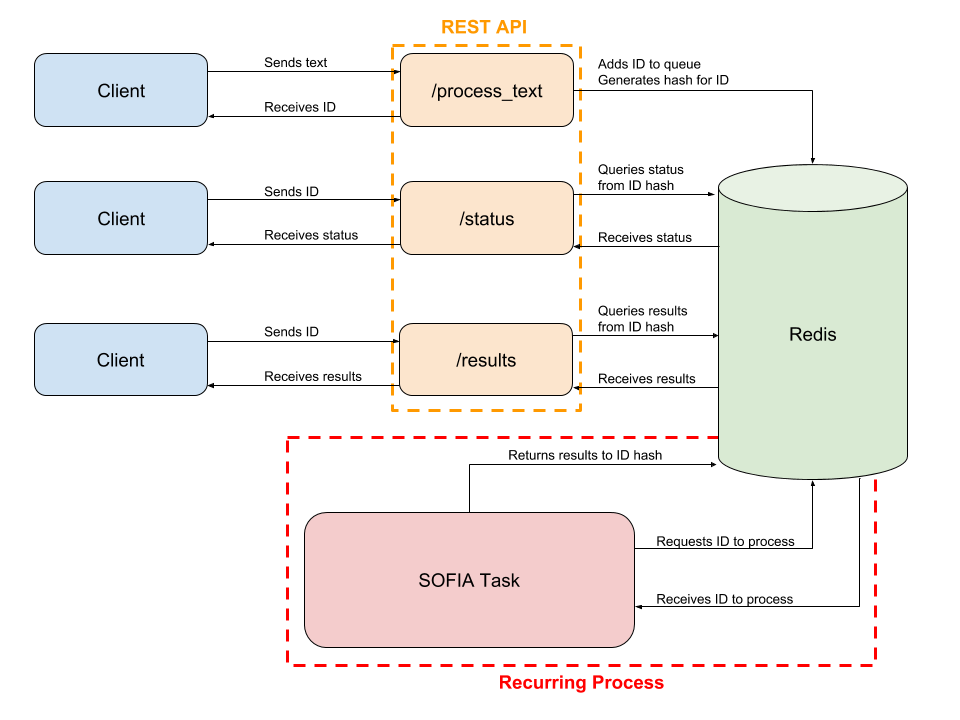

# World Modelers Project

## Contents

1. [Introduction](#introduction)
2. [SOFIA Overview](#sofia-overview)
3. [Usage](#usage)
4. [REST API](#rest-api)
5. [API Usage](#api-usage)
6. [API Architecture](#api-architecture)
7. [Redis Docker](#redis-docker)

## Introduction

This repo contains source code and other necessary files (eg Ontology) to run SOFIA tool. The input can be a sentence or a set of files which are already preprocessed via Stanford CoreNLP and stored as json. The output will be an xsl file containing all the relations that SOFIA identified.

## SOFIA Overview

SOFIA is an Information Extraction system that currently detects Causal Relationships explicitly mentioned in the same sentence. SOFIA is built based upon prominent Linguistic Theories that view Causality as a discourse relation between two Eventualities. Following this approach, SOFIA extracts three major classes of information: Entities, Events and Relations. All those classes are important in order to build a coherent model that captures the semantics of a sentence. Entities include the physical objects, people, organizations, etc, while eventualities denote some action/event, process, change of state that happens. Entities are arguments in Events (eg The car moves), while Events are arguments in Relations like Causality. In some cases, events can also be arguments for other events, which is a current area of research for SOFIA's modeling. Such events include 'increase/decrease' types amongst others, which in some cases might imply Causality (eg Drought increases famine), but in many others they do not (eg Drought increased over the last year). Thus, we consider important to carefully think how to model those before returning them as part of SOFIA's output.

SOFIA currently grounds the detected Events and Entities to her internal Ontology, We note that although the Ontology is subject to change in the future, we do not plan to change the Upper Level structure. Additional Information includes Time and Location, which SOFIA extracts for Events, when possible.

## Usage
First, install the [official Python Interface to Stanford CoreNLP](https://github.com/stanfordnlp/python-stanford-corenlp), which is not kept up to date on PyPi so it must be installed manually with:

```
git clone https://github.com/stanfordnlp/python-stanford-corenlp.git
cd python-stanford-corenlp
python setup.py install
```

Next, navigate back to the root of the SOFIA directory and run:

```
python setup.py install
```

> Note: if you are working with SOFIA for development purposes, then install it with `python setup.py develop`. This enables you to make changes to the code and see them reflected in the package without having to reinstall.

Then, you can try:

```
from sofia import SOFIA
sofia = SOFIA(CoreNLP='PATH_TO_UNZIPPED_CORENLP')
text = '''The intense rain caused flooding in the area and in the capital. This was terrible news for the people of Pandonia. Conflict in the region is on the rise due to the floods. The floods are a direct result of rain and inadequate drainage.'''
results = sofia.getOutputOnline(text)
sofia.results2excel('output.xlsx',results)
```

In this example, the `SOFIA` class is invoked to create the object `sofia`. To initialize the `SOFIA` class we must pass it the path to our unzipped CoreNLP installation. `SOFIA` uses the Python interface to CoreNLP to run CoreNLP Server in the background. 

A sentence can be passed to the `sofia` object using the `.getOutputOnline` method. This returns `results` which is an array of JSON objects where each object in the array represents each sentence provided to the reader.

Additionally, query based reading can be performed with:

```
query = ['food security', 'malnutrition', 'starvation', 'famine', 'mortality', 'die', 'conflict', 'IPC phase', 'flood']
q_results = sofia.writeQueryBasedOutput(text, query)
```

Where `q_results` is an array of JSON objects representing the results of query based reading. This can be written to Excel with:

```
sofia.results2excel('q_output.xlsx', q_results)
```

## REST API

A REST API built on Flask can be run by navigating to the `rest_api` directory. First, you shoud update `config.py` with the appropriate configurations. The primary consideration is whether you will be using [Redis](https://redis.io/) to service requests asynchronously. This is helpful when you expect documents to be large and need to submit many of them at once. More on that in the [API Architecture section below](#api-architecture).

The default is that Redis **will not be used**:
```
REDIS = False
```

Change this to `True` and specify the Redis instance in order to use Redis as a back-end as detailed in the [API Architecture section below](#api-architecture).

>Note: Flask-BasicAuth is used to authenticate the API. The username and password should be configured in `config.py`. The defaults are `TESTUSER` and `TESTPASSWORD`.

Once you have set the appropriate configuration, including the path to your CoreNLP instance, you can run the application with:

```
export FLASK_APP=REST_API.py
flask run
```

This runs the API at `localhost:5000`. If running the API without Redis, there are two relevant endpoints:

1. `/process_text`: receives text and processes it using basic SOFIA processing
2. `/process_query`: receives text and an array of queries and processes it using SOFIA's query based reading.

If using Redis, the endpoints take on a slightly modified flavor and there are 4 or them:

1. `/process_text`: receives text and returns an ID which can be used to retrieve results.
2. `/process_query`: receives text and returns an ID which can be used to retrieve results.
3. `/status`: receives an ID and returns a status: either `Processing` or `Done`.
4. `/results`: if an ID status is `Done` this endpoint receives the ID and returns the processed JSON.

### API Usage

#### Redis Implementation
If **Redis is in use**, then you can use the Python `requests` library to hit either of the primary endpoints using:

```
import requests
url = 'http://localhost:5000'

# process_text 
obj = {'text': 'The intense rain caused flooding in the area and in the capital'}
response = requests.post(url + '/process_text', json=obj, auth=('TESTUSER','TESTPASSWORD'))

# process_query
obj = {'text': 'The intense rain caused flooding in the area and in the capital',
       'query': ['food security', 'malnutrition', 'starvation', 'famine', 'flood']}
response = requests.post(url + '/process_query', json=obj, auth=('TESTUSER','TESTPASSWORD'))

response = response.json()
```
In this case, the response contains JSON which will look like this:

```
{'ID': 'e8694df8d22693ab1bd2a9ba04013391b27e7793', 'Status': 'Processing'}
```

The `response` from above can be sent to the `/status` endpoint to check the status of reading:

```
status = requests.post(url + '/status', json=response, auth=('TESTUSER','TESTPASSWORD'))
status = status.json()
```

This returns the status which will either look like the object above (e.g. `Status: Processing` or it will look like:

```
{'ID': 'e8694df8d22693ab1bd2a9ba04013391b27e7793', 'Status': 'Done'}
```

If reading is `Done`, then the results can be obtained by using the `/results` endpoint and the original `response` (as it contains the correct ID):

```
results = requests.post(url + '/results', json=response, auth=('TESTUSER','TESTPASSWORD'))
```

#### Basic Implementation
If **Redis is not being used**, then you can use the Python `requests` library to hit the two primary endpoints with:

```
import requests
url = 'http://localhost:5000'

# process_text 
obj = {'text': 'The intense rain caused flooding in the area and in the capital'}
response = requests.post(url + '/process_text', json=obj, auth=('TESTUSER','TESTPASSWORD'))
response.json()

# process_query
obj = {'text': 'The intense rain caused flooding in the area and in the capital',
       'query': ['food security', 'malnutrition', 'starvation', 'famine', 'flood']}
response = requests.post(url + '/process_query', json=obj, auth=('TESTUSER','TESTPASSWORD'))
response.json()
```
Note the response in each case is the reading output in JSON format.

### API Architecture

>**Note**: the architecture below *only* describes the scenario when `REDIS = True` in `config.py`.

The REST API has the option to use Redis as both a process queue and an in-memory data store for short-term storage of reading results. The primary goal is to de-couple the API from the SOFIA process itself. So, if reading is slow, the API will still be performant and responsive.



If Redis is used, when a request is submitted to the API it generates an `ID` for the request. It adds this `ID` to a Redis list (the queue) and creates a hash for the `ID` where information about the request will be stored, such as its status, the request text (and query) and ultimately its results.

Meanwhile, a SOFIA Task is run every 5 seconds. This task checks the queue to see if any new requests have been made. If it finds one, it pops it off the queue. If the queue has more than one item, this operation is first in first out (FIFO). It then performs reading on the request and stores the results back to the `ID`'s hash. 

The results of reading can be obtained by an API call to the `/results` endpoint.

By default, reading results are stored for 7 days and then expire. If `results` are obtained, a new time to live (TTL) is set for the `ID` to 24 hours. 

#### Redis Docker

To run Redis in a Docker container you can use:

```
docker pull redis
docker run -P 6379:6379 --name sofia-redis -d redis
```